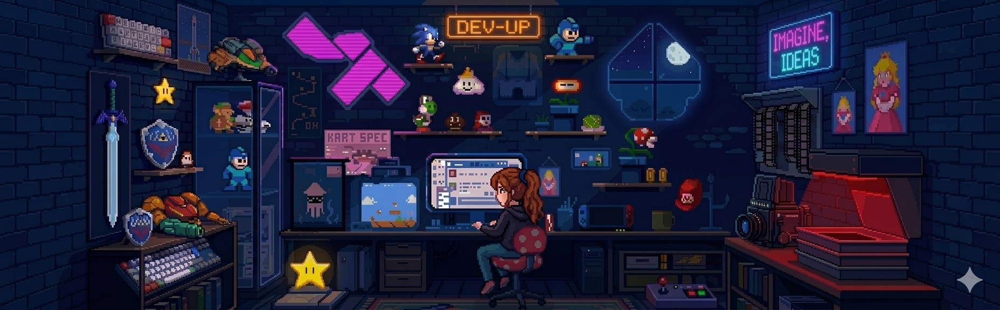

## 👩‍💻 About Me

- 💼 Principal Consultant @ Genpact
- 🌱 Currently learning Node.js
- ⚡ 10+ Years of Frontend Development
- 🚀 Angular (2–16), React, JavaScript & TypeScript
- 🎯 Passionate about UI Performance
- ⚡ Fun fact Coding is fun!

## 🚀 Tech Stack

  
  
  
  
  
  
  
  
  
  
  
  

## 🌐 Connect With Me

## 🚀 Featured Projects

| Project | Tech |
|---------|------|
| Dev Tinder | React, Node.js |
| Portfolio | React |
| NetflixGPT | React + OpenAI |
| Swiggy Clone | React + Redux |
